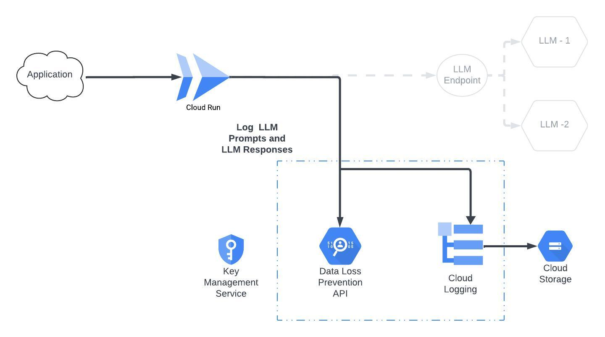
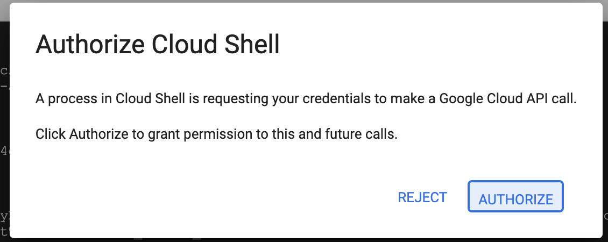

## LLM Logging Service

This project sets up a Cloud Run service to log and analyze LLM prompts using Google Cloud DLP to redact sensitive data such as SSNs and credit card numbers. The redacted images and logs reside in a Cloud Storage bucket. It uses Cloud KMS for key management and Cloud Storage for storing data. 



## Prerequisites

* **Google Cloud Project:** You'll need a Google Cloud Project with billing enabled. Have your [Project ID](https://support.google.com/googleapi/answer/7014113) ready for configuration, and determine which [location](https://cloud.google.com/storage/docs/locations) you want to use for your bucket.
* **Google Cloud APIs:** Ensure the following APIs are enabled. **The deployment script will not work without them.** (Click the Enable button on each console page):
   * [Cloud KMS API](https://console.cloud.google.com/apis/library/cloudkms.googleapis.com)
   * [Cloud DLP API](https://console.cloud.google.com/apis/library/dlp.googleapis.com)
   * [Cloud Run Admin API](https://console.cloud.google.com/apis/library/run.googleapis.com)
   * [Cloud Build API](https://console.cloud.google.com/apis/library/cloudbuild.googleapis.com)

## Setup & Deployment Instructions (Google Cloud Console)

1. **Clone the Repository:**
   * Open the Google Cloud Console.
   * Navigate to **Cloud Shell**. This provides a command-line interface directly within your browser that has authenticated access to your project and all the tools you need to run this project.
   * Clone this repository and navigate to the directory: 
     ```bash
     git clone https://github.com/GCP-Architecture-Guides/gcp-llm-logging.git
     cd gcp-llm-logging
     ```

2. **Run the Setup Scripts**

    * From inside `/gcp-llm-logging`:
    ```bash
    chmod +x setup.sh
    ./setup.sh
    ```
        
3. **Authorize:**

    Within Cloud Shell, you will get an authorization prompt. Click Authorize.

    

4. **Provision and Deploy:**
   * After configuration and authorization, the script will:
      * Create necessary storage buckets.
      * Generate a Cloud KMS keyring and keyset.
      * Store inputs and an encrypted key in the buckets.
      * Apply a DLP inspect template.
      * Deploy the Cloud Run service.

5. **Testing:**
   * Use the `curl` command provided at the end of the script's output to test the Cloud Run endpoint. You'll need to be authenticated with `gcloud auth login` beforehand.

6. **Viewing Logs:**
   * The script will also provide a link to Cloud Logging where you can view and analyze the logs generated by the LLM service. Alternatively, you can visit [Cloud Logging](https://console.cloud.google.com/logs/query) at any time and enter the following query: 
   
   ```
   logName="projects/<your-project-id>/logs/llm-prompt"
   ```
